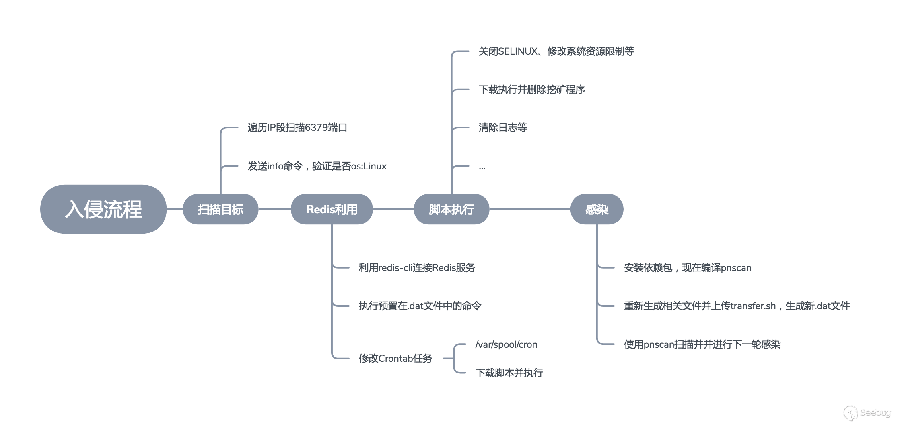

2019.12.22

#### Redis未授权问题获取Linux系统root权限的攻击方法

今天我自己的一台服务器就这样被挂上了挖矿脚本....

今天就了解一下我的服务器是如何被利用的。

1.在默认情况下，redis会绑定在0.0.0.0:6379,因为自己图方便就把防火墙给关了。这样就导致了redis服务器被暴露在公网上。同时我也了解到，如果没有开启授权的情况下，任意一个用户如果可以访问Redis服务器，那么就会在未授权的情况下访问Redis服务器，同时访问服务器。攻击者在未授权的情况下访问Redis，可以通过Redis的方法将自己的公钥写入到目标服务器的authotrized_keys文件中，进而可以直接登录目标服务器；而且如果Redis是以root用户登录的话，那么可以用此方法直接获取root用户权限。

安全策略

**Redis服务加固**

1. 导致入侵的主要原因是Redis未授权访问问题，所以如果要扼制入侵的入口，需要针对Redis服务进行加固，避免黑客通过该途径进行入侵植入挖矿蠕虫。
2. 如无必要，修改bind项，不要将Redis绑定在0.0.0.0上，避免Redis服务开放在外网，可以通过iptables或者腾讯云用户可以通过安全组限制访问来源
3. 在不影响业务的情况，不要以root启动Redis服务，同时建议修改默认的6379端口，大部分针对Redis未授权问题的入侵都是针对默认端口进行的
4. 配置AUTH，增加密码校验，这样即使开放在公网上，如果非弱口令的情况，黑客也无法访问Redis服务进行相关操作
5. 使用rename-command CONFIG "RENAME_CONFIG"重命名相关命令，这样黑客即使在连接上未授权问题的Redis服务，在不知道命令的情况下只能获取相关数据，而无法进一步利用

参考

[1].https://paper.seebug.org/605/