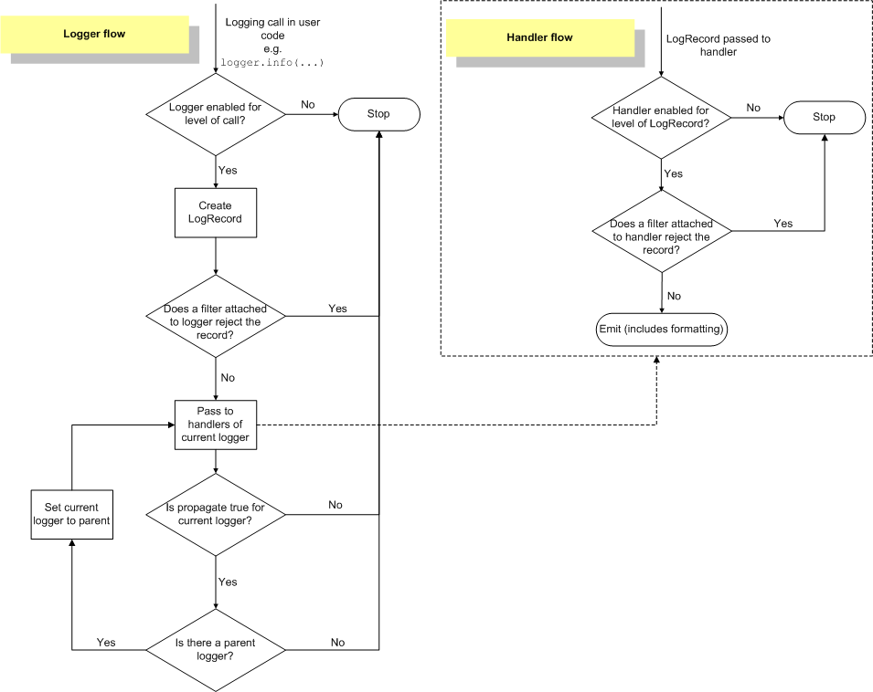

#### Python logging 模块的几个问题

1.logger 对象

2.logger对象的handler？

3.Formatter？

##### 0.basicConfig

​	使用`logging.basicConfig(**kwargs)` 会对对`root logger`进行一次性配置，比如如果只有logger对象而没有handler时会调用`basicConfig(**kwargs)`中的参数，如果没有`basicConfig(**kwargs)`则这个logger中记录的日志信息不会被输出。

​	`logging.basicConfig()`函数是一个一次性的简单配置工具使，也就是说只有在第一次调用该函数时会起作用，后续再次调用该函数时完全不会产生任何操作的，多次调用的设置并不是累加操作。

##### 1.Logger对象

​	Logger是直接提供给应用程式使用日志的接口。logging 的其他组件比如(Handler,Formatter,Filter)都是在初始化logger对象时使用的。

​	Logger对象不是通过实例化Logger而来的，都是通过 logging.get_logger(name) 获得一个与*name*关联的logger对象，logging内部会维护这个映射关系，用同样的name反复调用logging.getLogger，事实上返回的是同一个对象.

​	日志器（Logger）是有层级关系的，上面调用的logging模块级别的函数所使用的日志器是`RootLogger`类的实例，其名称为'root'，它是处于日志器层级关系最顶层的日志器，且该实例是以单例模式存在的。

##### 2.logger对象的handler？

​	Handler定义了如何处理一条日志，是本地打印，还是输出到文件，还是通过网络发送。

​	可以这么理解，日志代表的是一个事件（event），输出日志的应用程序是生产者，而handler是消费者，消费者可以有多个。

##### 3.Formatter

​	Formatter将LogRecord输出成字符串。应用程序每输出一条日志的时候，就会创建一个LogRecord对象.

##### 4.Filter

　　Filter提供的是比log level更精确的过滤控制，只有当Filter.filter函数返回True的时候，这条日志才会被输出。

　　由于Filter.filter函数的参数是LogRecord实例，那么可以修改LogRecord的属性。在example1.py 第25行   formatter = logging.Formatter('%(asctime)s - %(name)s - %(levelname)s - %(userid)s - %(message)s') file formatter中指定了属性%(**userid**)s， 但userid并不在Formatter的属性列表中，这个userid其实就是通过自定义的ContextFilter来实现的，在ContextFilter.filter中，给record对象添加了userid属性。后面还会细讲。

　　官方给出了很多例子，都是通过Filter来修改LogRecord的内容，来输出一些上下文信息（contextual information）。但是我觉得这是一个不好的设计，顾名思义，Filter应该只做过滤的事情，理论上不应该修改输入，builtin filter函数就是这样的。

logging 模块记录日志流程如下

----

