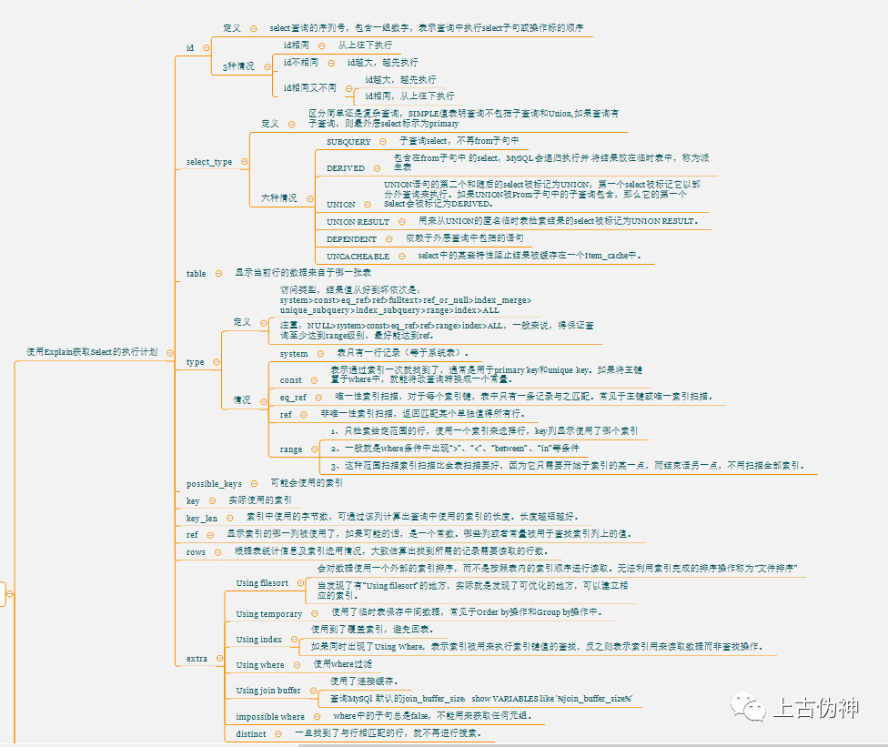

#### SQL 中exists 与in 的区别

```csharp
select * from A where id in (select id from B);

select * from A where exists (select 1 from B where A.id=B.id);
```

对于以上两种情况，in是在内存里遍历比较，而exists需要查询数据库，所以当B表数据量较大时，exists效率优于in。

#### 1、IN()语句内部工作原理

IN()只执行一次，它查出B表中的所有id字段并缓存起来。之后，检查A表的id是否与B表中的id相等，如果相等则将A表的记录加入结果集中，直到遍历完A表的所有记录。
 它的查询过程类似于以下过程：


```csharp
List resultSet={};
Array A=(select * from A);
Array B=(select id from B);

for(int i=0;i<A.length;i++) {
  for(int j=0;j<B.length;j++) {
      if(A[i].id==B[j].id) {
        resultSet.add(A[i]);
        break;
      }
  }
}
return resultSet;
```

可以看出，当B表数据较大时不适合使用in()，因为它会B表数据全部遍历一次

- 例1：A表有10000条记录，B表有1000000条记录，那么最多有可能遍历10000*1000000次，效率很差。
- 例2：A表有10000条记录，B表有100条记录，那么最多有可能遍历10000*100次，遍历次数大大减少，效率大大提升。

结论：IN()适合B表比A表数据小的情况

#### 2、EXISTS()语句内部工作原理

exists()会执行A.length次，它并不缓存exists()结果集，因为exists()结果集的内容并不重要，重要的是其内查询语句的结果集空或者非空，空则返回false，非空则返回true。
 它的查询过程类似于以下过程：

```csharp
List resultSet={};
Array A=(select * from A);

for(int i=0;i<A.length;i++) {
   if(exists(A[i].id) {  //执行select 1 from B where B.id=A.id是否有记录返回
       resultSet.add(A[i]);
   }
}
return resultSet;
```

当B表比A表数据大时适合使用exists()，因为它没有那么多遍历操作，只需要再执行一次查询就行。

- 例1：A表有10000条记录，B表有1000000条记录，那么exists()会执行10000次去判断A表中的id是否与B表中的id相等。
- 例2：A表有10000条记录，B表有100000000条记录，那么exists()还是执行10000次，因为它只执行A.length次，可见B表数据越多，越适合exists()发挥效果。
- 例3：A表有10000条记录，B表有100条记录，那么exists()还是执行10000次，还不如使用in()遍历10000*100次，因为in()是在内存里遍历比较，而exists()需要查询数据库，我们都知道查询数据库所消耗的性能更高，而内存比较很快。

结论：EXISTS()适合B表比A表数据大的情况

#### 3、使用情况分析

当A表数据与B表数据一样大时，in与exists效率差不多，可任选一个使用。

在插入记录前，需要检查这条记录是否已经存在，只有当记录不存在时才执行插入操作，可以通过使用 EXISTS 条件句防止插入重复记录。


```csharp
insert into A (name,age) select name,age from B where not exists (select 1 from A where A.id=B.id);
```

EXISTS与IN的使用效率的问题，通常情况下采用exists要比in效率高，因为IN不走索引。但要看实际情况具体使用：

- IN适合于外表大而内表小的情况；
- EXISTS适合于外表小而内表大的情况。

#### 4、关于EXISTS：

EXISTS用于检查子查询是否至少会返回一行数据，该子查询实际上并不返回任何数据，而是返回值True或False。

EXISTS 指定一个子查询，检测行的存在。

> 语法： EXISTS subquery

> 参数： subquery 是一个受限的 SELECT 语句 (不允许有 COMPUTE 子句和 INTO 关键字)。

> 结果类型： Boolean 如果子查询包含行，则返回 TRUE ，否则返回 FLASE 。

结论：

```csharp
select * from A where exists (select 1 from B where A.id=B.id)
```

EXISTS(包括 NOT EXISTS )子句的返回值是一个boolean值。 EXISTS内部有一个子查询语句(SELECT ... FROM...),我将其称为EXIST的内查询语句。其内查询语句返回一个结果集, EXISTS子句根据其内查询语句的结果集空或者非空，返回一个布尔值。

一种通俗的可以理解为：将外查询表的每一行，代入内查询作为检验，如果内查询返回的结果取非空值，则EXISTS子句返回TRUE，这一行行可作为外查询的结果行，否则不能作为结果。

分析器会先看语句的第一个词，当它发现第一个词是SELECT关键字的时候，它会跳到FROM关键字，然后通过FROM关键字找到表名并把表装入内存。接着是找WHERE关键字，如果找不到则返回到SELECT找字段解析，如果找到WHERE，则分析其中的条件，完成后再回到SELECT分析字段。最后形成一张我们要的虚表。

WHERE关键字后面的是条件表达式。条件表达式计算完成后，会有一个返回值，即非0或0，非0即为真(true)，0即为假(false)。同理WHERE后面的条件也有一个返回值，真或假，来确定接下来执不执行SELECT。

分析器先找到关键字SELECT，然后跳到FROM关键字将STUDENT表导入内存，并通过指针找到第一条记录，接着找到WHERE关键字计算它的条件表达式，如果为真那么把这条记录装到一个虚表当中，指针再指向下一条记录。如果为假那么指针直接指向下一条记录，而不进行其它操作。一直检索完整个表，并把检索出来的虚拟表返回给用户。EXISTS是条件表达式的一部分，它也有一个返回值(true或false)。




