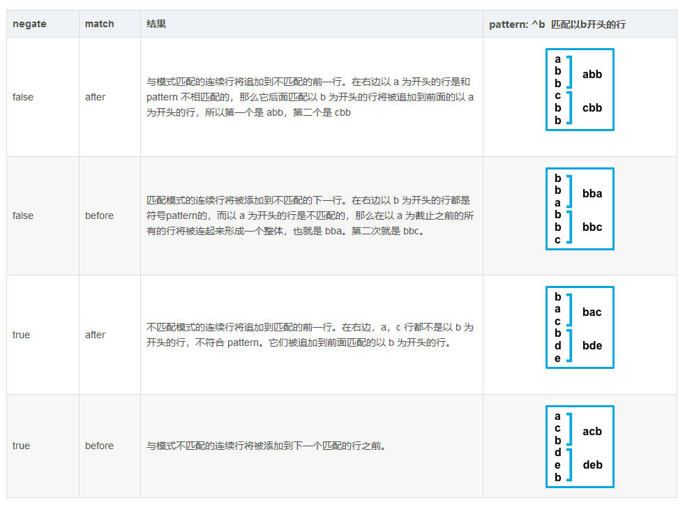

### Filebeat 使用

[TOC]


### 1.将filebeat 多行日志合并

.使用filebeat 将多行日志合并为es 的一个doc,默认情况下，filebeat 会将每一个的日志文件作为es 的一个doc 进行输入，要想将多行日志聚合在一起，需要配置以下几个参数,分别是

```
  multiline.pattern: '^[0-9]{4}/[0-9]{2}/[0-9]{2}'
  multiline.negate: true
  multiline.match: after
```

上面这个参数配置的含义是匹配日志文件中每行开头是日期个数的内容，如果不是日期格式的内容会与前面日志格式的内容合并为一个.

**multiline.pattern**

​	指定要匹配的正则表达式模式。 请注意，Filebeat支持的正则表达式模式与Logstash支持的模式有些不同。 有关受支持的正则表达式模式的列表，请参见正则表达式支持。 根据你配置其他多行选项的方式，与指定正则表达式匹配的行将被视为上一行的延续或新多行事件的开始。 你可以设置 negate 选项以否定模式。

**multiline.negate**

​	定义是否为否定模式，也就是和上面定义的模式相反。 默认为false。

**multiline.match**

​	指定Filebeat如何将匹配的行组合到事件中。 设置在之后 （after） 或之前 （before）


3.除此之外，filebeat 还可以指定特殊的开头和结束，可用如下参数指定

```
multiline.pattern: ‘Start new event’
multiline.negate: true
multiline.match: after
multiline.flush_pattern: ‘End event’
```

这个参数的含义是将以 'Start new event' 开头和 'End event'结尾的内容合并为一个doc 输入到es中。

### 2. 将不同位置的日志输出到ES不同的index中

即根据不同的日志设置不同的索引

```
filebeat.inputs:
# 配置多个input内容
- type: log

  enabled: true
  encoding: GB2312
  paths:
    - D:\frp\winsw.out.log
  # 设置区分的type
  fields:
     type: out-log
  # 设置多行合并的规则
  multiline.pattern: '^[0-9]{4}/[0-9]{2}/[0-9]{2}'
  multiline.negate: true
  multiline.match: after

- type: log
  enabled: true
  encoding: GB2312
  paths:
    - D:\frp\winsw.wrapper.log
  fields:
    type: wrapper-log
  multiline.pattern: '^[0-9]{4}-[0-9]{2}-[0-9]{2}'
  multiline.negate: true
  multiline.match: after

output.elasticsearch:
  # Array of hosts to connect to.
  hosts: ["localhost:9200"]
  index: "frplog-%{[fields.type]}-%{+yyyy.MM.dd}"
  indices: 
    - index: frplog-out-log-%{+yyyy.MM.dd}
      when.equals:
          fields.type: out-log
    - index: frplog-wrapper-log-%{+yyyy.MM.dd}
      when.equals:
          field.type: wrapper-log
  username: ""
  password: ""
  enable: true

# 配置多个index时需要配置以下内容
setup.ilm.enabled: false
setup.template.name: 'frplog'
setup.template.pattern: 'frplog-*'
setup.template.enabled: false
setup.template.overwrite: true
```


### Filebeat 占用文件句柄

具体表现为文件移动或者删除后磁盘空间没有释放，重启filebeat后可以清理掉。

配置以下参数

```
close_older:1h
# 设置为true 文件改名后会立即释放句柄，此时会有数据丢失的风险
force_close_files:false
# 文件更名时句柄会被释放,但是删除文件时不会释放句柄
close_renamed:true
#如果文件在指定的持续时间内没有更新，Filebeat会关闭文件句柄,默认值为5m
close_inactive:5m
# 指定扫描指定路径目录下是否有新的文件产生,默认值为10s
scan_frequency:10s
```


### 参考

[1].https://www.cnblogs.com/cjsblog/p/9495024.html

[2].https://www.jianshu.com/p/9710769e5199

[3].https://kingjcy.github.io/post/monitor/log/collect/filebeat/filebeat-principle/