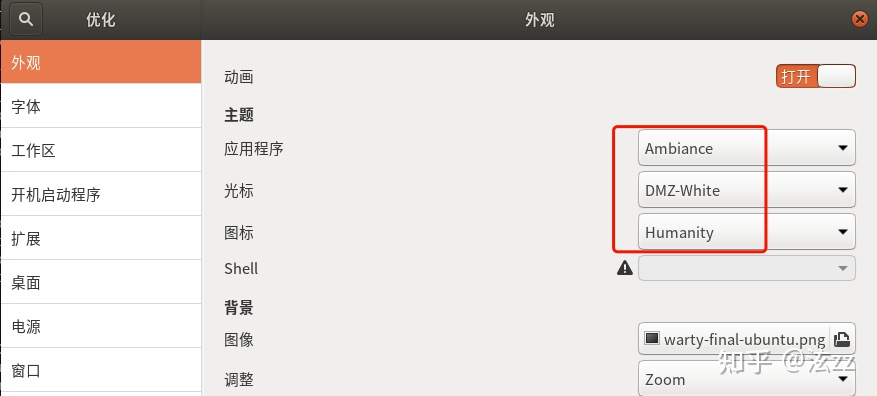

### Linux 相关配置

#### 0.安装有线驱动

我这里使用的是Realtek 8125 的有线网卡，在官方网站上下载驱动进行安装，网址如下

```
https://www.realtek.com/en/component/zoo/category/network-interface-controllers-10-100-1000m-gigabit-ethernet-pci-express-software
```

###　1.配置ssh

```
apt install ssh
```

`vim /etc/ssh/sshd_config`

修改部分配置为如下样式

```
PermitRootLogin yes
PasswordAuthentication yes
```

执行如下命令使配置生效

```
service restart sshd
systemctl enable sshd  #配置sshd 开机启动
```


####　2.配置xrdp

```
// 更新一下软件包的信息
$ sudo apt update
$ sudo apt install xorgxrdp
// 此时可能会遇到报错
下列信息可能会对解决问题有所帮助：

下列软件包有未满足的依赖关系：
 xorgxrdp : 依赖: xorg-video-abi-23
            依赖: xserver-xorg-core (>= 2:1.18.99.901)
E: 无法修正错误，因为您要求某些软件包保持现状，就是它们破坏了软件包间的依赖关系。
// 安装 xserver-xorg-core 来更新版本
$ sudo apt install xserver-xorg-core
// 然后安装需要的其他组件
$ sudo apt-get install xorgxrdp xserver-xorg-input-all xorg xrdp dbus-x11 x11-xserver-utils
```


##### 修改配置

编辑`startwm.sh`,设置远程连接的用户配置，类似于ssh时的全局配置`/etc/profile`

```
vim /etc/xrdp/startwm.sh
```

把最后两行注释之后加入一行 `gnome-session`，改好之后文件最后几行如下

```shell
#test -x /etc/X11/Xsession && exec /etc/X11/Xsession
#exec /bin/sh /etc/X11/Xsession

gnome-session
```

##### 开启端口并且重启服务

```text
// 开启防火墙
$ sudo apt install ufw
$ sudo ufw allow 3389
// 重启服务
$ sudo ufw restart
$ sudo service xrdp restart
```

至此就完成了服务器在远程桌面的配置


##### 图标缺失的问题$$^{[1]}$$

```
$ sudo add-apt-repository universe
$ sudo apt install gnome-tweak-tool
// 打开 tweak 设置主题等信息
$ gnome-tweaks
```

在弹出的界面进行设置图标等信息就行了




#### 4.安装kvm 

```
sudo apt -y install qemu-kvm libvirt-daemon bridge-utils virtinst libvirt-daemon-system
```

安装虚拟机配置的工具

```
sudo apt -y install virt-top libguestfs-tools libosinfo-bin  qemu-system virt-manager
```

##### 创建KVM Bridge


#### 5.开启ftp

1.安装ftp软件

```
apt install vsftpd
```

2.查看是否安装成功

```
which vsftpd
```

3.查看vsftpd 运行状态

```
service vsftpd status
```

4.查看服务有没有启动

```
netstat -an | grep 21
```

5.修改配置文件

```
chroot_local_user=NO
chroot_list_enable=NO
write_enable=YES
local_enable=YES
```

1、参数说明：

　　chroot_local_user：是否将所有用户限制在主目录,YES为启用 NO禁用.(该项默认值是NO,即在安装vsftpd后不做配置的话，ftp用户是可以向上切换到要目录之外的)；
　　chroot_list_enable：是否启动限制用户的名单 YES为启用  NO禁用(包括注释掉也为禁用)；
　　chroot_list_file：是否限制在主目录下的用户名单，至于是限制名单还是排除名单，这取决于chroot_local_user的值；
2、参数组合使用

|                        | chroot_local_user=YES                                        | chroot_local_user=NO                                         |
| ---------------------- | ------------------------------------------------------------ | ------------------------------------------------------------ |
| chroot_list_enable=YES | 1、所有用户都被限制在其主目录下 ；2、使用chroot_list_file指定的用户列表，这些用户作为“例外”，不受限制 | 1、所有用户都不被限制其主目录下 ； 2、使用chroot_list_file指定的用户列表，这些用户作为“例外”，受到限制； |
| chroot_list_enable=NO  | 1、所有用户都被限制在其主目录下 ；2、不使用chroot_list_file指定的用户列表，没有任何“例外”用户； | 1、所有用户都不被限制其主目录下 ；2、不使用chroot_list_file指定的用户列表，没有任何“例外”用户； |


#### 6. centos 配置固定ip

```
[root@localhost ~]# vi /etc/sysconfig/network-scripts/ifcfg-eth0
DEVICE=eth0                #设备驱动名称：

BOOTPROTO=static           #注意：修改此处为静态获取IP地址：共有三种选项：
ONBOOT=yes                 #重启网络服务时加载此网卡的配置：
IPADDR=192.168.122.100     #IP地址
NETMASK=255.255.255.0      #子网掩码
GATEWAY=192.168.122.1      #网关
DNS1=114.114.114.114       #DNS地址设置（优选与/etc/resolv.conf配置文件）
```


#### 7.配置端口映射

0.重置所有iptables 设置

```
# iptables -F
# iptables -X
# iptables -t nat -F
# iptables -t nat -X
# iptables -t mangle -F
# iptables -t mangle -X
# iptables -t raw -F
# iptables -t raw -X
# iptables -t security -F
# iptables -t security -X
# iptables -P INPUT ACCEPT
# iptables -P FORWARD ACCEPT
# iptables -P OUTPUT ACCEPT
```

1.允许数据包转发

```
echo 1 >/proc/sys/net/ipv4/ip_forward
iptables -t nat -A POSTROUTING -j MASQUERADE
iptables -A FORWARD -i [内网网卡名称] -j ACCEPT
iptables -t nat -A POSTROUTING -s [内网网段] -o [外网网卡名称] -j MASQUERADE

实际例子:
echo 1 >/proc/sys/net/ipv4/ip_forward
iptables -t nat -A POSTROUTING -j MASQUERADE
iptables -A FORWARD -i virbr0 -j ACCEPT
iptables -t nat -A POSTROUTING -s 192.168.122.1/24 -o enp42s0 -j MASQUERADE
```

本机的 9200端口映射到内网 虚拟机的9200端口

```shell
iptables -t nat -A PREROUTING -p tcp -m tcp --dport [外网端口] -j DNAT --to-destination [内网地址]:[内网端口]

iptables -t nat -A PREROUTING -d 192.168.3.70 -p tcp --dport 9200  -j DNAT --to-dest 192.168.122.100:9200
```

删除规则

```shell
#查看nat 表的所有规则
root@yuuri-workpc:~# iptables -L -t nat  --line-numbers
Chain PREROUTING (policy ACCEPT)
num  target     prot opt source               destination         
1    DNAT       tcp  --  anywhere             yuuri-workpc         tcp dpt:9200 to:192.168.122.100:9200
2    DNAT       tcp  --  anywhere             yuuri-workpc         tcp dpt:9201 to:192.168.122.101:9200
3    DNAT       tcp  --  anywhere             yuuri-workpc         tcp dpt:9202 to:192.168.122.102:9200        

# 含义是删除nat 表 PREROUTING 规则的第一条
iptables -t nat -D   PREROUTING 1
```

**7.1 iptables 基础概念**

iptables 支持内核2.4版本以上版本。2014年1月发行的Linux内核3.13版使用nftables替代了iptables,但是仍然提供iptables命令作为兼容接口。


1.四张表分别是**`filter`表**,**`nat`表**,**`mangle`表**,**`raw`表**,**`security`**。

2.五条链，分别是

- **PREROUTING,**

- **OUTPUT,**

- **FORWARD,**

- **INPUT,**

- **POSTROUTING**

3.表与链之间的关系

**filter表**

filter表为不指明表的情况下默认使用的表。通常用于过滤数据包，内建链包括：

- INPUT,输入链。发往本机的数据包通过此链

- OUTPUT,输出链。从本机发出的数据包通过此链

- FORWARD,转发链。从本机转发的数据包通过此链


**`nat`表**

nat表用于地址转换操作。内建链包括：

- PREROUTING,路由前链，在处理路由规则前通过此链，通常用于目的地址转换(DNAT)

- POSTROUTING,路由后链，完成路由规则后通过此链，通常用于源地址转换(SNAT)

- OUTPUT,输出链，类似POSTROUTING,但是处理本机发出的数据包

NAT分为源地址转换（代理上网），目的地址转换（端口映射）以及双向地址转换

**目的地址转换**，是一种单向的针对目标地址的映射，用于内部服务器向外部服务器提供服务的情况，与静态地址转换不同的地方在于它是单向的。外部可以主动访问内部，内部却不可以访问外部。另外可使用目的地址转换实现负载均衡的功能，即可以将一个目标地址转换为多个内部服务器地址，也可以通过端口的映射将不同的端口映射到不同的机器上


**源地址转换**是内网地址向外访问时发起访问的内网ip地址转换为指定的ip地址(可指定具体的服务以及相应的端口或端口范围)，这可以使内网中使用保留ip地址的主机访问外部网络，即内网的多部主机可以通过一个有效的公网地址访问外部网络。


**mangle表**

mangle 表用于处理数据包，其和nat表的主要区别在于，nat表侧重连接而mangle表侧重每一个数据包。内建链列表如下：

- PREROUTING

- OUTPUT

- FORWARD

- INPUT

- POSTROUTING


**raw表**

raw表用于处理异常，有如下两个内建链

- PREROUTING

- OUTPUT


**系统重启后iptables规则消失**

**方法一**：

1.使用`iptables-save`命令保存当前存在的规则

```shell
iptables-save > /etc/iptables.conf
```

2.使用`iptables-restore`命令重新载入规则(可以此命令写入`/etc/rc.local`)[etc/rc.local 可认为是配置开机启动的脚本]

```
iptables-restore < /etc/iptables.conf
```


**方法二**：

使用`iptables-persistent`来配置

```
sudo apt-get install iptables-persistent
```

使用`netfilter-persistent`来更新规则

```
sudo netfilter-persistent save
```

[参考资料]

[1].[xRDP – How to Fix Theme issues in Ubuntu 18.04 remote session](https://c-nergy.be/blog/?p=12155)

[2].https://wangchujiang.com/linux-command/c/iptables.html  (**iptables命令** 是Linux上常用的防火墙软件，是netfilter项目的一部分。可以直接配置，也可以通过许多前端和图形界面配置)

[3].https://linux.die.net/man/8/iptables (iptables man page)

[4].https://segmentfault.com/a/1190000038185254  ([Linux 或 Windows上实现端口映射](https://segmentfault.com/a/1190000038185254))

