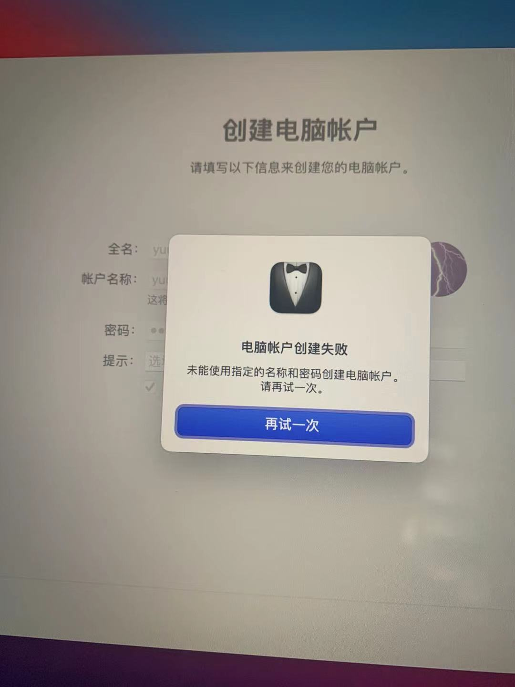

### M1 Mac 相关问题整理

#### 1.恢复出厂设置遇到的问题

问题描述：

恢复出厂设置重新安装操作系统后，出现电脑账户创建失败




解决办法：

> 按照一下步骤操作：
> \1. 启动至恢复分区
> \2. 启动终端
> \3. 运行终端命令：resetpassword
> \4. 单击"重置密码"窗口旁边的背景（空的地方），然后在菜单栏中选择"恢复助理（Recovery Assistant）"，然后选择"抹掉 Mac"。
> \5. 在打开的窗口中单击"抹掉 Mac"，然后再次单击" 抹掉 Mac"进行确认。 完成后，Mac将自动重新启动。
> \6. 抹除后会自动重新启动，重新启动后，将显示选择 WiFi，并提示激活。 激活完成后，需要选择[退出到恢复实用程序]选项，这将使我们返回恢复分区主界面。
> \7. 激活完成后。 您将看到正常的还原选项。 选择重新安装macOS Big Sur。


#### 2.Mac 终端开启代理

##### 1.开启http代理

在`~/.zprofile`中添加以下内容

```shell
# 配置不同类型的文件有不同的颜色
export CLICOLOR=1
export LSCOLORS=ExGxFxdaCxDaDahbadeche
# 配置ll 命令
alias ll='ls -alF'
# 配置代理相关参数,在终端中输入proxy 命令开启代理,unproxy关闭代理
alias proxy='export all_proxy=socks5://127.0.0.1:7890'
alias unproxy='unset all_proxy'
alias ip='curl cip.cc'
```


##### 2.开启ssh代理

在`~/.ssh/config`(如果文件不存在则手动创建)中添加以下内容

```shell
# host 设置指定域名走代理
Host github.com
# 走socks 代理,其中7890为端口号,根据实际情况自行修改
ProxyCommand=nc -X 5 -x 127.0.0.1:7890 %h %p
```

或者
```shell
Host github.com *.github.com
    User git
    # SSH默认端口22， HTTPS默认端口443
    Port 22
    Hostname %h
    # 这里放你的SSH私钥
    IdentityFile ~\.ssh\id_rsa
    # 设置代理, 127.0.0.1:10808 换成你自己代理软件监听的本地地址
    # HTTPS使用-H，SOCKS使用-S
    ProxyCommand connect -S 127.0.0.1:7890 %h %p
```
