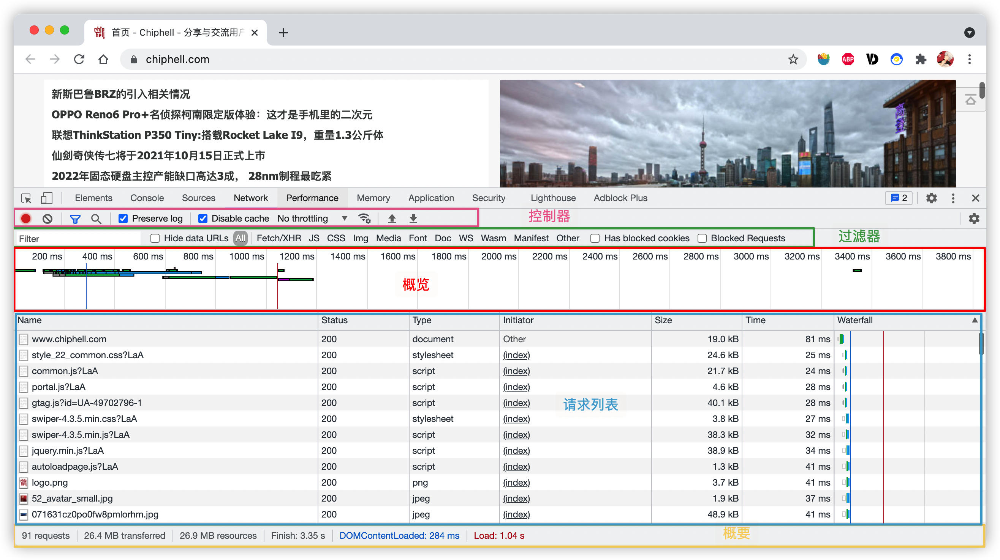

## Chrome Network 面板使用技巧

#### Chrome Network 面板构成

- 控制器, 控制外观与功能

- 过滤器,过滤请求资源 (Command键或者Ctrl键可以选中多个过滤器)
- 概览,显示HTTP请求
- 请求列表,时间排序(默认),显示列可选
- 概要,请求总数,请求数据量,请求资源耗时

#### 1. 控制器

- 抓包 

- 停止抓包  

- 清除请求  

- 是否隐藏过滤选项 

- Preserve log 

- Disable cache

- Network Throttling 

- Use large request rows

- Group by frame

- Capture screenshots

  

#### 过滤器

按类型:

- XHR、JS、CSS、Img、Media、Font、Doc、WS、Wasm、Manifest或Other.
- 多类型,按住Command 键或者Ctrl键 可以多选
- 按时间过滤,概览面板,拖动滚动条
- Hide data URLs:CSS 图片等小文件以Base 64 格式嵌入HTML中,过滤掉这部分请求,以减少请求数

属性过滤:

- **domin** :仅显示来自指定域的请求,通配符进行匹配多个
- **has-response-header**: 显示包含请求头的资源
- **is**: 使用is:running可以查找WebSockect资源,is:from-cache 可以查找出使用缓存的资源
- **large-than**:显示大于指定大小的资源(字节为单位).值设置为1000 等同于1k
- **method**: 显示通过指定请求方式的资源
- **mime-type**: 显示指定MIME 类型的资源
- **mixed-content**: 显示所有混合内容资源(mixed-content:all),或者仅显示当前显示的资源(mixed-content:displayed)
- **scheme**: 显示通过未保护HTTP(scheme:http)或者受保护HTTPS(cheme:https)检索的资源
- **set-cookie-domin**: 显示具有Set-Cookie标头并且Domain 属性与指定值匹配的资源
- **set-cookie-name**: 显示具有Set-Cookie 标头并且名称域指定值匹配的资源
- **set-cookie-value**: 显示具有Set-Cookie 标头并且值与指定值匹配的资源
- **status-code**: 仅显示状态码与指定代码匹配的资源

多个属性间通过空格进行AND 操作

#### 请求列表进行排序

- 时间排序,默认

- 按列排序
- 活动时间排序
  - Start Time
  - Response Time
  - End Time
  - Total Duration 连接设置时间和请求/响应时间最短的请求位于顶部
  - Latency

请求列表内容

- Name 资源名称
- Status HTTP 状态码
- Type 请求资源的MIME 类型
- Initiator 发起请求的对象或进程.可能有以下几种值:
  - Parser
  - Redirect
  - Script
  - Other 一些其他经常或者动作发起请求,如用户点击或者在浏览器中输入网址
- Size 服务器返回响应大小
- Time 总持续时间,从请求开始到接收响应中的最后一个字节
- Waterfall 各请求相关活动的直观分析图

- 查看请求上下游: 按住Shift 键悬停请求上,绿色是上游,红色是下游

#### 浏览器加载时间

触发流程:

- 解析HTML 结构
- 加载外部脚本核样式表文件
- 解析并执行脚本代码 // 部分脚本会阻塞页面的加载
- DOM 树构建完成 // DOMContentLoaded 事件
- 加载图片等外部文件
- 页面加载完毕 // load 事件

请求时间详细分布:

- **Queueing**: 以下情况会出现排队
  - 存在更高优先级的请求
  - 此源已打开六个TCP 连接,达到上限,仅适用于HTTP/1.0 和HTTP/1.1
  - 此浏览器正在短暂分配磁盘缓存中的空间
- **Stalled**: 请求可能会因为Queueing 中描述的任何原因而停止
- **DNS Lookup**: 浏览器正在解析请求的IP 地址
- **Proxy Negotiatio**n: 浏览器与代理服务器正在协商
- **Request sent**:正在发送请求
- **ServiceWorker Preparation**: 浏览器正在启动Service Worker
- **Request to ServiceWorke**r: 正在将请求发送到Service Worker
- **Waiting(TTFB**): 浏览器正在等待响应的第一个字节.TFFB 表示 Time To First Byte(至第一字节的时间).此时间包括一次往返延迟及服务器准备响应所用的时间
- **Content Download**: 浏览器正在接收响应
- **Receive Push**: 浏览器正在通过HTTP/2 服务器推送接受此响应的数据
- **Reading Push**: 浏览器正在读区之前收到的本地数据

