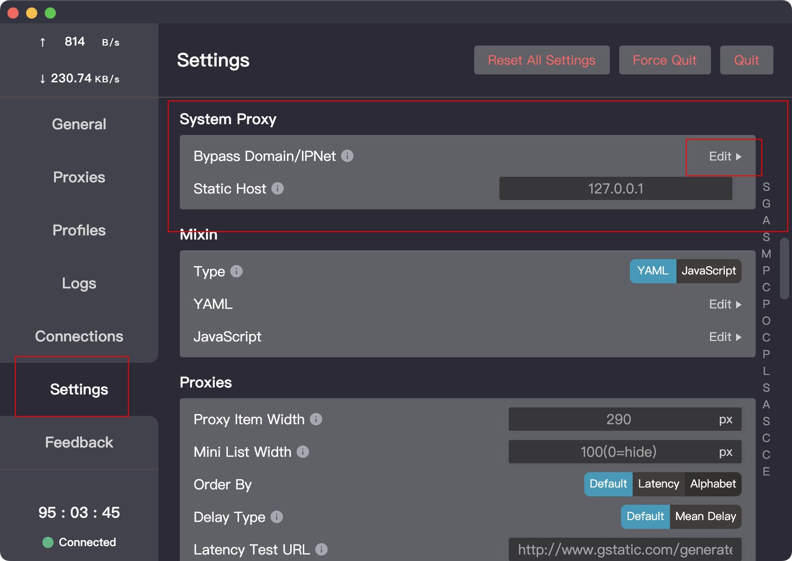
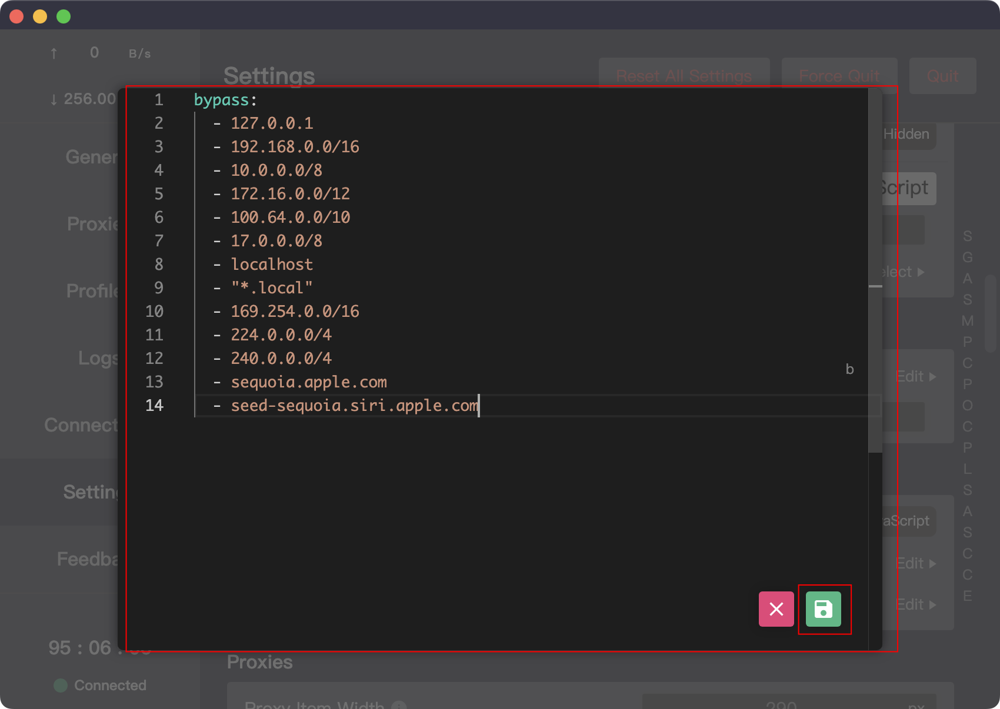

### Mac 自带翻译由于代理导致不可用问题

Mac的自带翻译由于会检测是否存在代理行为会导致不可用，需要进行额外配置

1.在Clash for Windows 中的Settings -> System Proxy 中进行额外配置即可



点击Edit 进行配置，增加以下两行内容

```yaml
  - sequoia.apple.com
  - seed-sequoia.siri.apple.com
```

增加后内容如下




点击保存，使得变更生效


参考:

[1].https://zhuanlan.zhihu.com/p/581119370