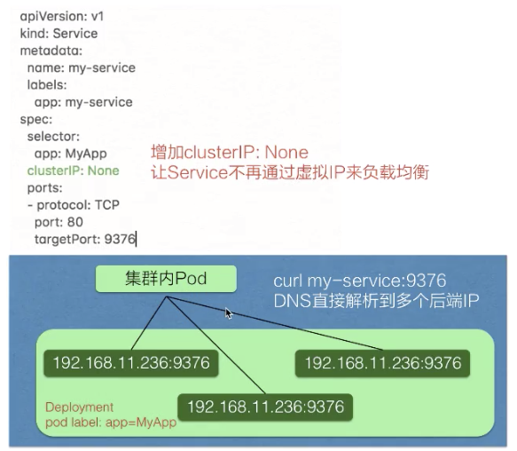
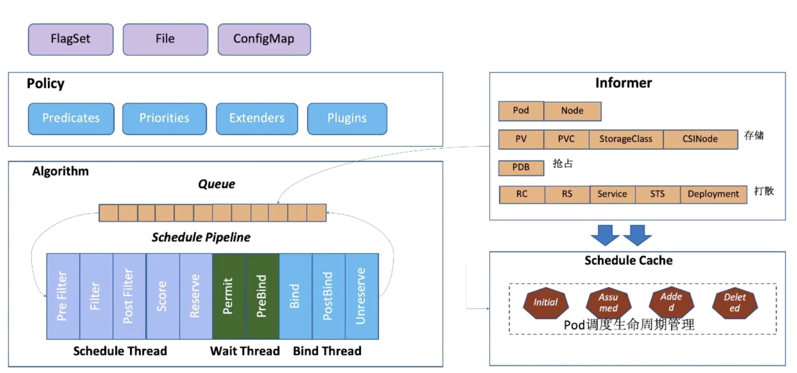
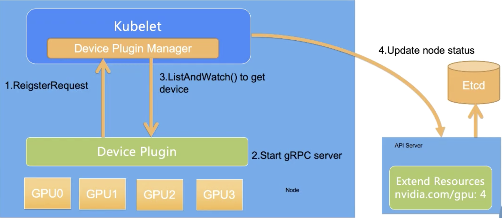
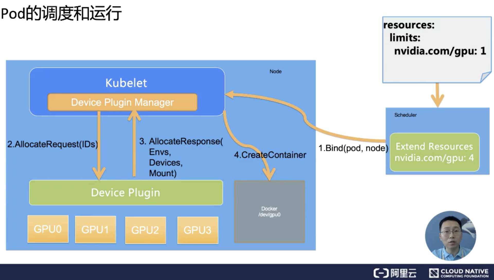
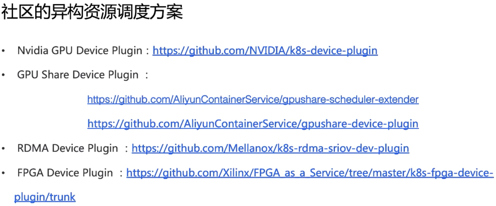

### Kubernetes 

[TOC]


#### 1.云原生概念

#### 2.容器基本概念

#### 3.Kubernetes基本概念

- 安装MiniKube  https://developer.aliyun.com/article/221687
- 安装kubectl [https://kubernetes.io/zh/docs/tasks/tools/install-kubectl-linux/]

#### 4.Pod 

Pod 实现机制:

- 共享网络

- 共享存储

  

容器设计模式 SideCar

- 1.Init Container
- 2.Proxy Container
- 3.Adapter Container


总结:

- Pod 是Kubernetes 实现 容器设计模式的核心机制
- 容器设计模式是Google Borg 的大规模容器集群管理最佳实践
  - 也是Kubernetes 进行复杂应用编排的基础依赖之一
- 所有设计模式的本质都是解耦和重用


#### 5. 应用与编排-核心原理

**Kubernetes 资源对象**

- Spec
- Status
- Metadata
  - Labels
  - Annotation
  - OwnReference

**控制器模式**

- 控制循环

  ​	控制器模式的核心,控制循环包括了**控制器,被控制的系统,以及能够观测系统的传感器.**

  ​	外界通过修改资源spec来控制资源,控制器比较资源spec和status,从而计算出diff,根据diff来决定执行对系统进行怎样的控制操作.控制操作会产生新的输出,被传感器以资源status的形式上报,控制器的各个组件都会是独立自主的运行,根据资源的status进行调整下一步的操作,不断的趋近spec终态.

  

- Sensor

  控制循环中逻辑传感器由以下三个组件构成

  - Reflector

  - Informer

  - Indexer

    ​	Reflector 通过List 和Watch K8s server 获取资源数据.List 在Controller 重启以及Watch 中断的情况下,进行系统的全量更新;而Watch 则在多次List 之间进行增量的资源更新.Reflector 在获取新的资源数据后,会在Delta 队列中塞入一个包括资源对象信息本身以及资源对象事件类型的Delta 记录,Delta队列中可以保证同一个对象在队列中仅有一条记录,避免Reflector 重新List 和Watch 的时候产生重复的记录.

    ​	Informer 组件不断从Delta队列中弹出delta 记录,然后把资源对象交给Indexer, 让indexer 把资源记录在缓存中,缓存默认设置为用资源命名空间作为索引,可以背Controller Manager 或多个Controller 所共享.再把事件交给事件的回调函数

- 控制循环的控制器组件

  ​	主要有两部分组成,分别是:

  - 事件处理函数

  - worker 

    事件处理函数会关注资源的新增,修改,删除的事件,并根据控制器的逻辑决定是否需要进行处理.对需要处理的事件,会把事件关联的资源空间和名字塞入一个工作队列中,由后续的work池中的一个work进行操作,对于工作队列会进行去重操作,避免多个work 处理同一个资源

- 总结:

  - Kubernetes 所采用的控制器模式,是由声明式API驱动.或者说是基于对Kubernetes 资源对象修改驱动的

  - Kubernetes 资源背后是关注该资源的控制器,控制器将驱动异步控制系统走向设置的最终状态

  - 控制器是自主运行的,可以实现自动化和无人值守

  - Kubernetes 的控制器和资源都是可以自定义的,可以方便的扩展控制器模式.特别对于有状态应用,我们往往通过自定义资源和控制器的方式来自动化运维操作.


#### 6.编排与管理-Deployment

- Deployment: 管理部署发布的控制器


查看Deployment 状态

```
kubectl get deployment
```


- Deployment 只负责管理不同版本的ReplicaSet,由ReplicaSet 管理Pod副本数

- 每个ReplicaSet 对应了一个Deployment template 的一个版本
- 一个ReplicaSet 下面的Pod 都是相同版本

**Deployment 控制器**

**ReplicaSet 控制器**


#### 7.编排与管理-Job与DaemonSet

- Job 管理任务的控制器

  新的参数:

  - restartPolicy 重启策略
  - backoffLimit 重试次数

**查看Job 状态**

```
kubectl get jobs
```

- 并行运行job

  spec中新增如下参数:

  - completions:代表pod 执行的次数
  - parallelism:代表并行执行的pod 个数

- CronJob

  - schedule: crontab 格式相同
  - startingDeadlineSeconds: 最长执行时间
  - concurrencyPolicy: 是否允许并行
  - successfulJobHistoryLimit:运行留存历史Job 个数

**Job-管理模式**

- Job Controller 负责根据配置创建pod
- Job Controller 跟踪Job 状态,根据配置及时重试或者创建pod
- Job Controller 会自动添加label 跟踪pod,并根据配置并行或者串行创建pod

**Job 控制器**


**DaemonSet:守护进程控制器**

- 保证集群内每一个(或一些)节点都运行一组相同的 Pod
- 跟踪集群节点状态,保证新加入的节点自动创建对应的Pod
- 跟踪集群节点状态,保证删除对节点删除对应的Pod
- 跟踪Pod 状态,保证每个Pod 处于运行状态

DaemonSet 适用场景:

- 集群存储进程: glusterd,Ceph
- 日志收集进程:fluentd,logstash
- 需要在每个节点运行的监控收集器


查看DaemonSet 

```
kubectl get ds
```

更新DaemonSet

- RollingUpdate:默认更新策略,当更新模版后,老旧的Pod 模版会被删除,然后创建新的Pod,可以配合健康检查做滚动更新
- OnDelete:更新DaemonSet 模版后,只有手动的删除对应的Pod,此节点的Pod 才会更新.


**DaemonSet -管理模式**

- DaemonSet Controller 负责根据配置创建Pod
- DaemonSet Controller 跟踪Job状态,根据配置及时重试或创建Pod
- DaemonSet Controller 会自动添加affinity&label 跟踪对应的Pod,根据配置在每个节点或者适合的节点创建Pod


**DaemonSet-控制器**


#### 8.应用配置管理

- **ConfigMap**

- **Secret**

- **ServiceAccount**

  解决集群身份认证问题

- **Resource**

  容器资源配置管理

- **SecurityContext**

- **InitContainer**


#### 9.应用存储和持久化数据卷-核心知识

- Volume
  - Persistent Volumes
  - Persistent Volume Claim
  - Static Volume Provisioning


#### 10.应用存储和持久化数据卷-存储快照与拓扑调度

- Kubernetes CSI Snapshot Controller
- 存储拓扑调度问题 
  - Local PV 只能在指定的Node 上被Pod 使用 (PV 有位置限制[.spec.nodeAffinity], 当Pod 从原来Node1 迁移到Node2 时就会产生问题) 
  - Pod 与PV 不在同一可用区(Zone)

- 处理流程
  - Volume Snapshot 处理流程
  - Volume Topology-aware Scheduling 处理流程


#### 11.可观测性

- Liveness 

- Readiness

- 应用健康诊断方式

  - 探测方式

    - httpGet .

      发送Http请求,返回结果在200-399之间状态码则表明容器健康

    - Exec. 

      通过命令来检查服务是否正常,命令返回0则表示容器健康

    - tcpSocket

      通过容器的IP 和Port执行TCP检查,如果能建立起TCP连接则表示容器健康

  - 诊断结果

    - Success. Container通过了检查
    - Failed.     Container未通过检查
    - Unknown. 未能执行检查,不做任何操作

  - 重启策略

    - Always 总是重启
    - OnFailure 失败才重启
    - Never 从不重启

- 应用健康故障排除

  - 通过describe 查看状态,通过状态判断排查方向
  - 查看对象event事件,查看更详细的信息
  - 查看pod 日志确定应用自身情况

- 常见应用异常

  - Pod停留在Pending

  Pending 表示调度器没有介入,可以通过`kubectl describe pod`,查看时间排查问题,通常和资源使用相关.

  - Pod 停留在Waiting

  一般表示Pod 的镜像没有正常的拉取,通常可能和私有镜像拉取,镜像地址不存在,镜像公网拉取相关.

  - Pod 不断被拉起且可以看到crashing

  通常表示Pod 已经完成调度并启动,但是启动失败,通常是由配置、权限造成,需要查看Pod 日志.

  - Pod处于running 但是没有正常工作

  通常是由于部分认证字段拼写错误造成,可以通过校验部署来排查, `kubectl apply -validate -f pod.yaml`

  - Service 无法正常工作

  排除网络自身的问题之外,最有可能的问题是label配置有问题,可以通过查看endpoint 的方式进行检查.

- 启用远程应用调试

  - 代理本地应用到集群 - Telepresence
  - 代理远程应用到本地 - Port-Forward
  - 开源调试工具 - kubectl-debug


#### 12.可观测性-监控与日志

- 监控
  - 资源监控
  - 性能监控
  - 安全监控
  - 性能监控

- 日志
  - 主机内核日志
  - runtime日志
  - 核心组件日志
  - 部署应用日志
- 日志采集
  - 宿主机文件
  - 容器内文件
  - 容器标准/错误输出
- fluentd 日志采集方案


#### 13.Kubernetes 网络概念与策略

- 基本网络模型

  - 三个基本条件
    - Pod 与Pod 之间直接通信,无需显式使用NAT
    - Node 与Pod 之间直接通信,无需显式使用NAT
    - Pod 可见的IP地址确为其他Pod 与其通信时所用,无需显式转换
  - 四大目标
    - 容器与容器之间对通信
    - Pod 与Pod 之间的通信
    - Pod 与Service 之间的通信
    - 外部世界与Service 的通信

- Network Namespace (Netns)

  - 实现内核网络虚拟化的基础,创建了隔离的网络空间
  - 独立的附属网络设备 (lo、veth等虚拟设备或者物理网卡)
  - 独立的协议栈,IP地址和路由表
  - iptables规则
  - ipvs等

- Pod 与Netns关系

  - 每个Pod 拥有独立的Netns空间,Pod 内的Container 共享该空间,通过共享等Pod-IP对外提供服务
  - 宿主机上还有Root Netns,可以看作一个特殊的容器空间

- 常见的网络实现方案

  - Flannel,最为普遍的实现,提供多种网络backed实现,覆盖多种场景
  - Calico,采用BGP提供网络直连
  - Canal(Flannel for Network + Calico for firewalling) ,嫁接型创新项目
  - Cilium,基于eBPF + XDP的高性能Overlay网络方案
  - Kube-route,同样采用BGP提供网络直连,集成机遇LVS的负载均衡能力
  - Romana,采用BGP or OSPF提供网络直连能力的方案
  - WeaveNet,采用UDP封装实现L2 Overlay,支持用户态(慢,可加密)/内核态(快,不能加密)两种实现

- Network Policy

  基于策略的网络控制,用于隔离应用并减少攻击面.使用标签选择器模拟传统的分段网络,并通过策略控制他们的之间的流量以及外部流量

  使用之前要注意:

  - api server 开启extensions/v1beat1/networkpolicies

  - 网络插件要支持Network Policy,如Calico、Romana、WeaveNet、trireme等

  - 配置实例

    通过标签选择器(包括namespaceSelector 和PodSelector)来控制Pod流量

    - 控制对象 

    通过spec字段,podSelector筛选

    - 流方向

    Ingress(入Pod 流量) + from、Egress(出Pod 流量) + to

    - 流特征

    对端(通过name/PodSelector)、IP端(idBlock)、协议(Protocol)、端口(Port)

- Pod 网络的基本要素
  - Pod 有独立的网络空间和唯一地址
  - Pod 与Pod ，Node，外界网络互相连通
- Network Policy
  
  - 控制Pod 到Pod，Node，外界网络的访问限制

#### 14.Kubernetes Service

- Kubernetes 已用如何相互调用

  - Pod 生命周期短暂，IP随时发生变化
  - Deployment等Pod组需要统一访问入口和做负载均衡
  - 应用在不同环境部署时保持同样的部署拓扑和访问方式

- 创建和查看service

  - 创建service

    ```
    kubectl apply -f service.yml
    # 或者
    kubectl creared -f service.yml
    ```

  - 查看service

    ```
    kubectl describe service my-service
    ```

- 集群内访问Service

  - 通过service 的虚拟ip进行访问
  - 直接访问服务名
  - 通过环境变量进行访问

- Headless Service

  创建service时可以指定clusterIP:None，即不会分配IP，Pod可以通过service_name 以DNS的方式解析到所有后端Pod 的IP地址，通过DNS的A记录方式会解析到所有后端的Pod的地址，由客户端选择一个后端的Ip地址，这个A记录会随着Pod的生命周期变化，返回A记录列表也发生变化，要求客户端应用要从DNS返回的A纪录列表中选择一个合适的IP进行访问。



- 集群外部暴漏service

  - NodePort

    NodePort是在集群的node（集群节点的宿主机）上暴漏节点的一个端口，当有请求访问时节点接收到请求后会把请求转发到对应的虚拟IP地址上

  - Loadbalancer

  LoadBalancer 类型是在NodePort上又添加了一层，NodePort是集群节点上的端口，LoadBalancer是在所有节点之上添加了一个负载均衡。这个负载均衡会提供一个统一的入口，把接触到的流量负载均衡到每一个集群节点的Node Pod上，然后Node Pod 在转化成ClusterIP 去访问到实际的Pod 上。


####  从0开始创作云原生应用

- Helm 与Helm Chart
  - 编写程序
  - 填写dockerfile 打包镜像
  - 创建helm 空白应用
  - Chart 配置
  - Temple 配置
  - 校验与打包
  - 安装测试
  - 参数覆盖
  - 修改Notes
  - 升级版本


#### 15.深入剖析Linux 容器

- namespace
  - mount
  - uts
  - pid
  - network
  - user
  - ipc
  - cgroup

- unshare 

- cgroups

  - 两种驱动
    - systemd cgroup driver
    - cgroupfs cgroup drive
  - 容器中常用的cgroup
    - cpu cpuset cpuacct
    - memory
    - device 
    - freezer
    - blkio
    - pid

  - 不常用的cgroup(针对docker来讲)
    - net_cls
    - net_prio
    - hugetlb
    - perf_event
    - rdma

- 容器镜像

  - docker images:
    - 基于联合文件系统
    - 不同的层可以被其他镜像复用
    - 容器的可写层可以作为镜像新的一层
  - 以overlay为例

- 容器引擎

  - Containerd 容器架构
  - shim v1/v2
  - OCI
  - Containerd 容器架构-容器流程示例


#### 16.深入理解etcd:基本原理

- 架构及内部机制解析

  - etcd 数据版本号机制

  - etcd mvcc & streaming watch

  - mini-transactions

  - lease 的概念与用法

- 使用场景

  - 元数据存储-- Kubernetes
  - Service Discovery(Naming Service)
    - 资源注册
    - 存活性检测
    - API gateway 无状态
    - 支持上万进程的规模
  - Dsitributed Coordination:leader election
  - 分布式系统并发控制


#### 17.深入理解etcd:etcd性能优化实践

- 理解etcd 性能
  - Raft
    - 网络IO节点之间的RTT/带宽
    - WAL 受到磁盘IO 写入延迟的影响
  - Storage
    - 磁盘IO fdatasync延迟
    - 索引层锁的block
    - boltdbTx的锁
    - boltdb本身的性能
  - 其他
    - 内核参数
    - grpc api层延迟


- etcd性能优化-服务端

  - 硬件

    - CPU、Memory
    - 磁盘选择SSD
    - 网络带宽优先级
    - 独占部署,减少其他程序运行时干扰

    https://etcd.io/docs/v3.5/op-guide/hardware/

    软件

    - 内存索引层

    提升etcd内存索引性能,优化内存锁的使用减少等待时间(https://github.com/etcd-io/etcd/pull/9511)

    - lease 规模使用

    优化lease revoke和过期失效的算法,解决lease 规模性的问题 (https://github.com/etcd-io/etcd/pull/9418)

    - 后端boltdb 使用优化

    后端batch size limit/interval,可根据不同的硬件和工作负载配置(之前为固定保守值)

    (https://github.com/etcd-io/etcd/commit/3faed211e535729a9dc36198a8aab8799099d0f3)

    - 完全并发读 优化调用boltdb tx 读写锁使用,提升读性能

      (https://github.com/etcd-io/etcd/pull/10523)

    - 基于segregated hashmap 的etcd 内部存储freelist分配回收算法

- etcd性能优化-客户端
  - put 时避免大value,精简再精简,例如k8s crd的使用
  - 避免创建频繁变化的key/values,例如k8s下node数据上传
  - 避免创建大量lease,尽量选择复用,例如k8s下event 数据管理


#### 18.Kubernetes 调度和资源管理

- Kubernetes 调度过程

- Kubernetes 基础调度能力

  - Pod Qos 配置
  - 配置资源Quota
  - Pod 亲和力调度
    - Pod 亲和调度  PodAffinity
      - 必须和某些Pod 一起调度   requireDuringSchedulingIgnoreDuringExceution
      - 优先和某些Pod 一起调度   preferredDuringSchedulingIgnoreDuringExceution
    - Pod反亲和调度 PodAntiAffinity
      - 禁止和某些Pod 一起调度   requireDuringSchedulingIgnoreDuringExceution
      - 优先不和某些Pod 一起调度   preferredDuringSchedulingIgnoreDuringExceution
    - Operator
      - In/Not/Exists/DoesNotExist
  - 满足Pod 与 Node关系调度
    - NodeSelector
      - 必须调度到带了某些标签的Node
      - Map[String]string
    - NodeAffinity
      - 必须调度到某些Node上   requireDuringSchedulingIgnoreDuringExceution
      - 优先调度到某些Node上  preferredDuringSchedulingIgnoreDuringExceution
      - Operator
        - In/Not/Exists/DoesNotExist/Gt/Lt
    - Node 标记/容忍
      - Node Tains
        - 一个Node 可以有多个Taints
        - Effect （不能为空）
          - NoSchedule  - 只是禁止新Pod 调度
          - PreferNoSchedule - 尽量不调度到这台
          - NoExecute - 会Evict没有对应toleration的Pods， 并且也不会调度新的上来
      - Pod Tolerations
        - 一个Pod 可以有多个Tolerations
        - Effect 可以为空，匹配所有
          - 取值和Taints的Effect 一致
        - Operator
          - Exists/Equal

- Kubernetes 高级调度能力

  - 基础调度策略：

    - 先到先得策略（FIFO） - 简单、公平、上手快
    - 优先级策略（Priority） - 符合日常公司业务特点

  - 优先级调度和抢占

    - Priority

      - 创建PriorityClass
      - 为各个Pod 配置不同PriorityClassName
      - 一些内置优先级
        - 内置默认优先级 DefaultPriorityWhenNoDefaultClassExists = 0
        - 用户可配置的最大优先级限制 HighestUserDefaultPriority = 100 0000 0000 (10亿)
        - 系统级别优先级限制 SystemCriticalPriority = 200 0000 0000(20亿)
        - 内置系统级别优先级
          - system-cluster-critical
          - system-node-critical
      - 优先级调度过程

    - Preemption

      - 优先级抢占过程

      - 优先级抢占策略

        - 优先选择打破PDB 最少的节点
        - 其次选择待抢占Pods 中最大优先级最小的节点
        - 再次选择待抢占Pods 优先级加和最小的节点
        - 接下带选择待抢占Pods 数目最小的节点
        - 最后选择拥有最晚启动的Pod 的节点

        在上面五步串行策略后，会选择一个合适的节点，然后对节点上待抢占的Pod 进行delete 这样就完成了一次待抢占的过程。


#### 19.调度器的调度流程和算法介绍

- 调度流程

  


- 调度算法
  - Predicates
  - Priorities

- 如何配置调度器
  - 如何启动一个调度器
    - 默认配置(--write-config-to)
    - 配置文件(--config)
  - 配置文件解释
  - algorithmSource
    - Provider
    - file
    - configMap
- 如何扩展调度器
  - Scheduler Extender
    - 功能
      - 不改变原先调度的代码,直接在调度外起服务作为插件给调度器调用(类似webhook)
      - 支持preficate,preempt,priority,bind的注入
      - 一种ExtendResource,Bind 只能一个extender
    - 配置文件解释
    - 案例
      - 申请GPU现存,具体卡的显存只有Extender知道,所以增加Extender的Filter
  - Scheduler Framework
    - 扩展点用途
    - 并发模型
    - 自定义Plugin
      - vendor
      - fork


#### 20.GPU管理和Device Plugin工作机制

- 需求来源

- GPU的容器化

  - 构建支持GPU容器镜像
    - 直接使用官方深度学习容器镜像
    - 基于NVIDIA的CUDA镜像基础构建
  - 利用Docker 将该容器镜像运行起来,并把GPU设备和依赖库映射到容器中
  - GPU容器镜像原理

- K8s的GPU管理

  - 部署GPU Kubernetes

    - 安装NVIDIA 驱动

    ```bash
    sudo yum install -y gcc kernel-device-$(uname -r)
    sudo /bin/sh ./NVIDIA-Linux-x86_64*.run
    ```

    - 安装NVIDIA Docker2

    ```bash
    sudo yum install nvidia-docker2
    sudo pkil -SIGHUP dockerd
    ```

    - 部署NVIDIA Device Plugin

    ```bash
    kubectl create -f nvidia-device-plugin.yml
    ```

    - 验证部署GPU Kubernetes 结果

    ```bash
    kubectl describe node-gpu-node-01
    ```

    - 查看运行结果

    ```
    $ kubectl apply -f groupod.yml
    pod/gpu created
    
    $kubectl exec -it gpu --nvidia-smi
    ```

  

- 工作原理

  - 通过扩展的方式管理GPU 资源
    - Extended Resource
    - Device Plugin Framework

  - Extended Resource 的上报

  - Device Plugin 的工作机制

    - 资源上报和监控

    

    - Pod的调度和运行

    

  - Device Plugin 机制的缺陷

    - 设备调度发生在Kubelet 层面,缺乏全局调度视角
    - 资源上报信息有限导致调度精细度不足
    - 调度策略简单,并且无法配置,无法应对复杂场景

  - 社区的异构资源调度方案

  


#### 21.Kubernetes 存储架构及插件使用

- Kubernetes 存储体系架构
  - PV Controller:负责PV/PVC的绑定,生命周期的管理,并根据需求进行数据卷的Provision/Delete操作;
  - AD Controller:负责存储设备的Attach/Detach操作,将设备挂载到目标节点;
  - Volume Manager:管理卷的Mount/Unmount操作,卷设备的格式化等;
  - Volume Plugins:扩展各种存储类型的卷管理能力,实现第三方存储的各种操作能力与Kubernetes系统结合;
  - Scheduler:实现Pod 调度能力,存储相关的调度器实现了针对存储卷配置进行调度
- FlexVolume介绍及使用
- CSI介绍及使用


[参考资料]

[1].https://edu.aliyun.com/roadmap/cloudnative

[2].https://time.geekbang.org/column/intro/116

[3].https://portworx.com/ (#1 Kubernetes Storage Platform)

[4].https://blog.frognew.com/post.html
